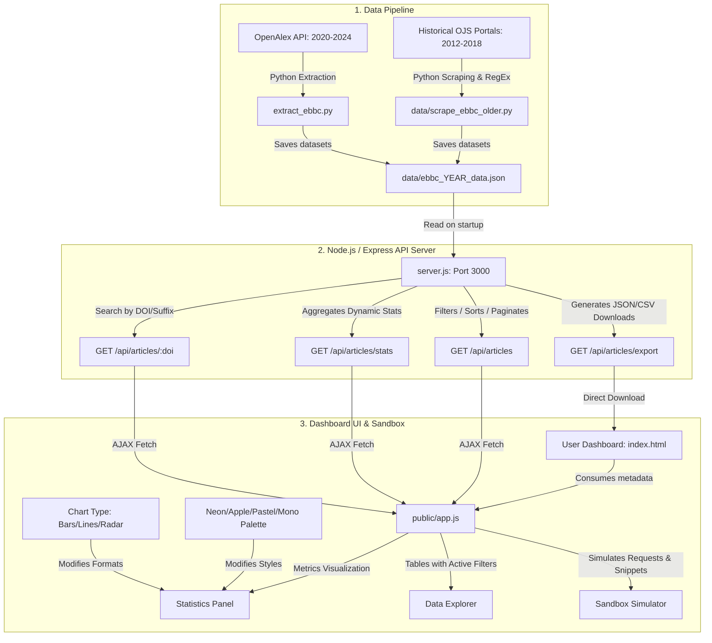

# 📊 EBBC OpenData — Proceedings Portal & Public API

<div align="right">
  <a href="README.md">🇧🇷 Português</a> | <b>🇺🇸 English</b>
</div>

[](https://doi.org/10.5281/zenodo.20722055)
[](https://github.com/GabrielBaiano/EBBC-OpenData)

**EBBC OpenData** is a public scientific platform and API designed to consolidate, analyze, and export bibliometric metadata and methodological classifications from all viable historical editions of the **Brazilian Meeting on Bibliometrics and Scientometrics (EBBC)**, covering the period from **2012 to 2024**.

The project aims to foster Open Science and assist researchers and information scientists in conducting systematic reviews, scientometric analyses, and methodological studies on Brazilian scientific production in metric studies.

---

## 🏗️ System Architecture and Data Flow

The platform operates across three layers: initial data extraction (Pipelines), the web data service (REST API), and the visual exploration interface (Single Page Application).



---

## ⚡ Main Project Resources

*   **Unified Dataset (2012–2024):** 643 articles cataloged in an identical and standardized manner.
*   **Methodology Curatorship:** Automated classification of software and tools used (*VOSviewer, R, Python, Gephi, Excel, etc.*), data collection sources (*Web of Science, Scopus, OpenAlex, etc.*), and methodological application stages.
*   **Customizable Statistics Dashboard:**
    *   **Chart Type:** Dynamic format switching between **Bars/Columns**, **Lines/Connections**, and **Radar (Web)**.
    *   **Color Palettes:** Customized visual styles including **Apple Minimalist**, **Neon Cyberpunk**, **Soft Pastel**, and **Sleek Monochrome**.
*   **Advanced Data Explorer:** Combined search filters, pagination, and instant export in open formats (JSON and CSV).
*   **Interactive Documentation with Sandbox:** API request tester with **real-time code generator** in **JavaScript**, **Python**, and **cURL** commands.

---

## 🚀 How to Run the Project Locally

### Prerequisites
*   [Node.js](https://nodejs.org/) (v16 or higher)
*   [Python 3](https://www.python.org/) (in case you need to run data extraction and scraping scripts)

### Initialization Steps
1. Install backend dependencies:
   ```bash
   npm install
   ```
2. Initialize the API web server:
   ```bash
   npm start
   ```
3. Access the platform in the browser at:
   ```
   https://ebbcopendata.vercel.app/
   ```

---

## 📡 Public API Endpoints

**Base URL (production):** `https://ebbcopendata.vercel.app`

---

### 1. List of Articles with Filters
```
GET /api/articles
```

**Query Parameters (Query Params):**

| Parameter | Type | Default | Description |
| :--- | :--- | :--- | :--- |
| `search` | string | — | Text search in title, abstract, authors, keywords, tools, and sources. |
| `year` | string | — | Filters by edition. Accepts multiple separated by comma (e.g. `2022,2024`). |
| `author` | string | — | Filters by author name (partial search). |
| `tool` | string | — | Filters by software/tool used (e.g. `VOSviewer`, `R`). |
| `source` | string | — | Filters by data collection source (e.g. `Scopus`, `Lattes`). |
| `stage` | string | — | Filters by methodological stage: `coleta de dados` (data collection), `análise dos dados` (data analysis), `visualização` (visualization). |
| `has_tool` | boolean | — | `true` returns only articles using any tool. |
| `sort` | string | `title` | Sorting field: `title`, `year`, or `doi`. |
| `order` | string | `asc` | Sorting direction: `asc` or `desc`. |
| `limit` | integer | `20` | Quantity of results per page. |
| `offset` | integer | `0` | Quantity of items to skip (pagination). |

**Response example:**
```json
{
  "total": 643,
  "filteredCount": 12,
  "limit": 20,
  "offset": 0,
  "results": [ { "doi": "...", "title": "...", "year": 2024, "authors": [...] } ]
}
```

---

### 2. Consolidated Statistics
```
GET /api/articles/stats
```
Returns dynamically calculated aggregated data: total articles, distribution by edition, tool adoption rate, ranking of top tools, main collection sources, and distribution by methodological stage.

---

### 3. Search by Individual DOI

Supports **four calling formats**:

```
# Format A — URL-encoded DOI (recommended for standard HTTP clients)
GET /api/articles/{doi_url_encoded}
Example: GET /api/articles/https%3A%2F%2Fdoi.org%2F10.22477%2Fix.ebbc.260

# Format B — DOI suffix with raw slashes
GET /api/articles/doi/{doi_suffix}
Example: GET /api/articles/doi/10.22477/ix.ebbc.260

# Format C — Full DOI URL with raw slashes
GET /api/articles/doi/{doi_url_completa}
Example: GET /api/articles/doi/https://doi.org/10.22477/ix.ebbc.260

# Format D — Query param (fallback)
GET /api/articles/doi?value={doi}
Example: GET /api/articles/doi?value=https://doi.org/10.22477/ix.ebbc.260
```

---

### 4. File Export
```
GET /api/articles/export
```
Exports the filtered subset for download. Accepts the same filters as the `/api/articles` endpoint (except `limit` and `offset`).

| Parameter | Values | Default |
| :--- | :--- | :--- |
| `format` | `json` or `csv` | `json` |

**Quick examples:**
```
GET /api/articles/export?format=json&year=2024
GET /api/articles/export?format=csv&tool=VOSviewer
```

---

## 🛠️ Methodological Curatorship Details (Filters and RegEx)
The automatic extraction of software and data sources analyzes the combination of Title, Abstract, and Keywords of each submission based on the following matches:

| Category | Tool / Source | Regular Expression Pattern (Regex) |
| :--- | :--- | :--- |
| **Software** | VOSviewer | `\bvosviewer\b` |
| | Gephi | `\bgephi\b` |
| | CiteSpace | `\bcitespace\b` |
| | Bibliometrix | `\bbibliometrix\b` |
| | Python | `\bpython\b` |
| | R (language) | Contextualized expression to avoid false positives from Portuguese articles |
| **Sources** | Web of Science | `\bweb\s+of\s+science\b\|wos` |
| | Scopus | `\bscopus\b` |
| | OpenAlex | `\bopenalex\b` |
| | Google Scholar | `\bgoogle\s+scholar\b` |

---

## 📄 License
This project is licensed under the **MIT License** — see the [LICENSE](LICENSE) file for details.

---

## 🗣️ How to Cite / Como Citar

If you used **EBBC OpenData** in your research, please cite it using one of the formats below.

### 📌 Zenodo (Official DOI)

**ABNT:**
> GAMA, Gabriel Nascimento. **EBBC OpenData: Portal e API Pública de Metadados dos Anais do EBBC (2012–2024)**. Zenodo, 2026. DOI: [10.5281/zenodo.20722056](https://doi.org/10.5281/zenodo.20722056). Available at: https://ebbcopendata.vercel.app.

**APA:**
> Gama, G. N. (2026). *EBBC OpenData: Portal e API Pública de Metadados dos Anais do EBBC (2012–2024)*. Zenodo. https://doi.org/10.5281/zenodo.20722056

**BibTeX:**
```bibtex
@software{gama_2026_ebbc_opendata,
  author       = {Gama, Gabriel Nascimento},
  title        = {{EBBC OpenData: Portal e API Pública de Metadados dos Anais do EBBC (2012--2024)}},
  year         = {2026},
  publisher    = {Zenodo},
  doi          = {10.5281/zenodo.20722056},
  url          = {https://doi.org/10.5281/zenodo.20722056}
}
```

---

### 🐙 GitHub (Repository)

**ABNT:**
> GAMA, Gabriel Nascimento. **EBBC OpenData**. GitHub, 2026. Available at: https://github.com/GabrielBaiano/EBBC-OpenData. Accessed on: [date of access].

**APA:**
> Gama, G. N. (2026). *EBBC OpenData* [Software]. GitHub. https://github.com/GabrielBaiano/EBBC-OpenData

**BibTeX:**
```bibtex
@software{gama_2026_ebbc_opendata_github,
  author       = {Gama, Gabriel Nascimento},
  title        = {{EBBC OpenData}},
  year         = {2026},
  publisher    = {GitHub},
  url          = {https://github.com/GabrielBaiano/EBBC-OpenData}
}
```
