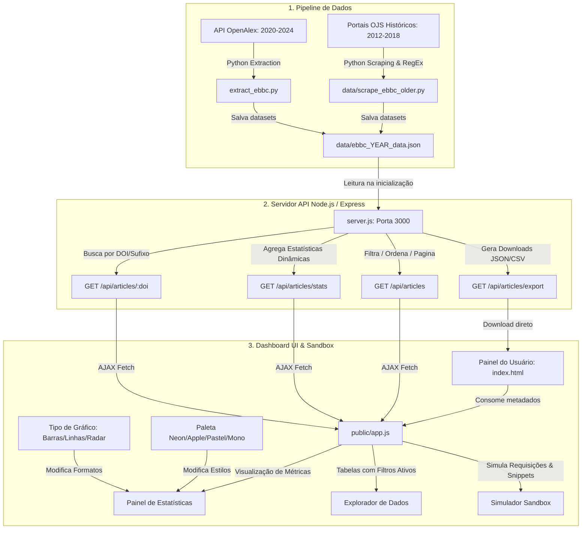

# 📊 EBBC OpenData — Portal & API Pública de Anais

[](https://doi.org/10.5281/zenodo.20722056)
[](https://github.com/GabrielBaiano/EBBC-OpenData)

O **EBBC OpenData** é uma plataforma e API científica pública projetada para consolidar, analisar e exportar os metadados bibliométricos e classificações metodológicas de todas as edições históricas viáveis do **Encontro Brasileiro de Bibliometria e Cientometria (EBBC)**, cobrindo o período de **2012 a 2024**.

O projeto visa fomentar a Ciência Aberta e auxiliar pesquisadores e cientistas da informação na realização de revisões sistemáticas, análises cientométricas e estudos metodológicos sobre a produção científica brasileira em estudos métricos.

---

## 🏗️ Arquitetura do Sistema e Fluxo de Dados

A plataforma funciona em três camadas: a extração inicial de dados (Pipelines), o serviço web de dados (REST API) e a interface visual de exploração (Single Page Application).



---

## ⚡ Principais Recursos do Projeto

*   **Dataset Unificado (2012–2024):** 643 artigos catalogados de forma idêntica e padronizada.
*   **Curadoria de Metodologia:** Classificação automatizada dos softwares e ferramentas utilizados (*VOSviewer, R, Python, Gephi, Excel, etc.*), fontes de dados coletadas (*Web of Science, Scopus, OpenAlex, etc.*) e etapas metodológicas de aplicação.
*   **Painel Customizável de Estatísticas:**
    *   **Tipo de Gráfico:** Alternância dinâmica de formato entre **Barras/Colunas**, **Linhas/Conexões** e **Radar (Teia)**.
    *   **Paletas de Cores:** Estilos visuais personalizados, incluindo **Apple Minimalist**, **Neon Cyberpunk**, **Pastel Suave** e **Monocromático Sleek**.
*   **Explorador Avançado de Dados:** Filtros combinados de pesquisa, paginação e exportação instantânea em formatos abertos (JSON e CSV).
*   **Documentação Interativa com Sandbox:** Testador de chamadas de API com **gerador de código em tempo real** nas linguagens **JavaScript**, **Python** e comandos **cURL**.

---

## 🚀 Como Executar o Projeto Localmente

### Pré-requisitos
*   [Node.js](https://nodejs.org/) (v16 ou superior)
*   [Python 3](https://www.python.org/) (caso precise rodar os scripts de extração e raspagem de dados)

### Passos para Inicialização
1. Instale as dependências de backend:
   ```bash
   npm install
   ```
2. Inicialize o servidor web da API:
   ```bash
   npm start
   ```
3. Acesse a plataforma no navegador em:
   ```
   https://ebbcopendata.vercel.app/
   ```

---

## 📡 Endpoints da API Pública

**Base URL (produção):** `https://ebbcopendata.vercel.app`

---

### 1. Lista de Artigos com Filtros
```
GET /api/articles
```

**Parâmetros de Consulta (Query Params):**

| Parâmetro | Tipo | Padrão | Descrição |
| :--- | :--- | :--- | :--- |
| `search` | string | — | Busca textual em título, resumo, autores, palavras-chave, ferramentas e fontes. |
| `year` | string | — | Filtra por edição. Aceita múltiplos separados por vírgula (ex: `2022,2024`). |
| `author` | string | — | Filtra por nome de autor (busca parcial). |
| `tool` | string | — | Filtra por software/ferramenta utilizada (ex: `VOSviewer`, `R`). |
| `source` | string | — | Filtra por fonte de coleta de dados (ex: `Scopus`, `Lattes`). |
| `stage` | string | — | Filtra por etapa metodológica: `coleta de dados`, `análise dos dados`, `visualização`. |
| `has_tool` | boolean | — | `true` retorna apenas artigos que usam alguma ferramenta. |
| `sort` | string | `title` | Campo de ordenação: `title`, `year` ou `doi`. |
| `order` | string | `asc` | Sentido da ordenação: `asc` ou `desc`. |
| `limit` | integer | `20` | Quantidade de resultados por página. |
| `offset` | integer | `0` | Quantidade de itens a pular (paginação). |

**Exemplo de resposta:**
```json
{
  "total": 643,
  "filteredCount": 12,
  "limit": 20,
  "offset": 0,
  "results": [ { "doi": "...", "title": "...", "year": 2024, "authors": [...] } ]
}
```

---

### 2. Estatísticas Consolidadas
```
GET /api/articles/stats
```
Retorna dados agregados calculados dinamicamente: total de artigos, distribuição por edição, taxa de adoção de ferramentas, ranking das top ferramentas, principais fontes de coleta e distribuição por etapa metodológica.

---

### 3. Busca por DOI Individual

Suporta **três formatos** de chamada:

```
# Formato A — DOI URL-encoded (recomendado para clientes HTTP padrão)
GET /api/articles/{doi_url_encoded}
Exemplo: GET /api/articles/https%3A%2F%2Fdoi.org%2F10.22477%2Fix.ebbc.260

# Formato B — Sufixo do DOI com barras brutas
GET /api/articles/doi/{doi_suffix}
Exemplo: GET /api/articles/doi/10.22477/ix.ebbc.260

# Formato C — URL completa do DOI com barras brutas
GET /api/articles/doi/{doi_url_completa}
Exemplo: GET /api/articles/doi/https://doi.org/10.22477/ix.ebbc.260

# Formato D — Query param (fallback)
GET /api/articles/doi?value={doi}
Exemplo: GET /api/articles/doi?value=https://doi.org/10.22477/ix.ebbc.260
```

---

### 4. Exportação de Arquivos
```
GET /api/articles/export
```
Exporta o subconjunto filtrado para download. Aceita os mesmos filtros do endpoint `/api/articles` (exceto `limit` e `offset`).

| Parâmetro | Valores | Padrão |
| :--- | :--- | :--- |
| `format` | `json` ou `csv` | `json` |

**Exemplos rápidos:**
```
GET /api/articles/export?format=json&year=2024
GET /api/articles/export?format=csv&tool=VOSviewer
```

---

## 🛠️ Detalhes da Curadoria Metodológica (Filtros e RegEx)
A extração automática de softwares e fontes de dados analisa a combinação de Título, Resumo e Palavras-chave de cada submissão com base nas seguintes correspondências:

| Categoria | Ferramenta / Fonte | Padrão de Expressão Regular (Regex) |
| :--- | :--- | :--- |
| **Softwares** | VOSviewer | `\bvosviewer\b` |
| | Gephi | `\bgephi\b` |
| | CiteSpace | `\bcitespace\b` |
| | Bibliometrix | `\bbibliometrix\b` |
| | Python | `\bpython\b` |
| | R (linguagem) | Expressão contextualizada para evitar falsos positivos de artigos em português |
| **Fontes** | Web of Science | `\bweb\s+of\s+science\b\|wos` |
| | Scopus | `\bscopus\b` |
| | OpenAlex | `\bopenalex\b` |
| | Google Scholar | `\bgoogle\s+scholar\b` |

---

## 📄 Licença
Este projeto é licenciado sob a **Licença MIT** — consulte o arquivo [LICENSE](LICENSE) para mais detalhes.
