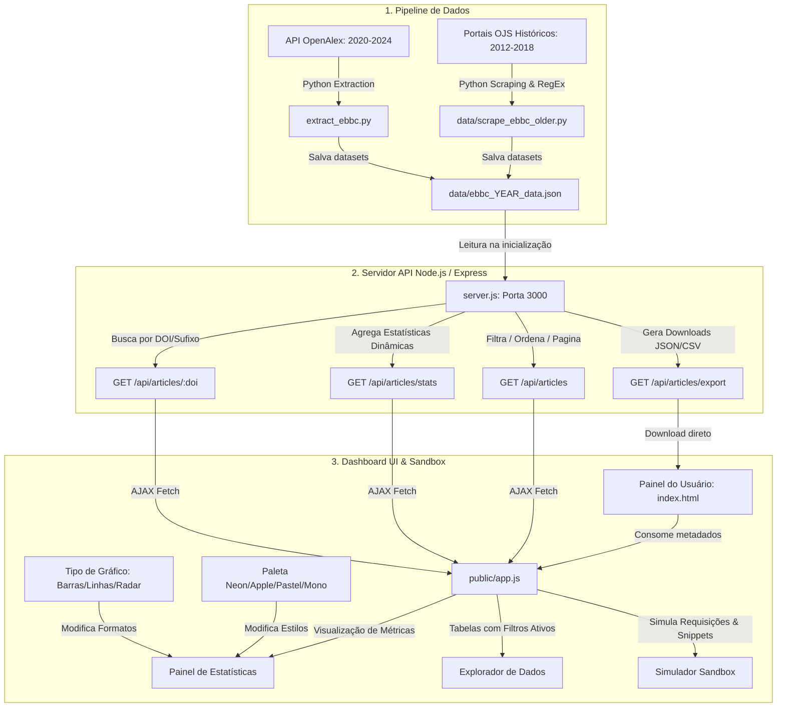

# 📊 EBBC OpenData — Portal & API Pública de Anais

O **EBBC OpenData** é uma plataforma e API científica pública projetada para consolidar, analisar e exportar os metadados bibliométricos e classificações metodológicas de todas as edições históricas viáveis do **Encontro Brasileiro de Bibliometria e Cientometria (EBBC)**, cobrindo o período de **2012 a 2024**.

O projeto visa fomentar a Ciência Aberta e auxiliar pesquisadores e cientistas da informação na realização de revisões sistemáticas, análises cientométricas e estudos metodológicos sobre a produção científica brasileira em estudos métricos.

---

## 🏗️ Arquitetura do Sistema e Fluxo de Dados

A plataforma funciona em três camadas: a extração inicial de dados (Pipelines), o serviço web de dados (REST API) e a interface visual de exploração (Single Page Application).



---

## ⚡ Principais Recursos do Projeto

*   **Dataset Unificado (2012–2024):** 643 artigos catalogados de forma idêntica e padronizada.
*   **Curadoria de Metodologia:** Classificação automatizada dos softwares e ferramentas utilizados (*VOSviewer, R, Python, Gephi, Excel, etc.*), fontes de dados coletadas (*Web of Science, Scopus, OpenAlex, etc.*) e etapas metodológicas de aplicação.
*   **Painel Customizável de Estatísticas:**
    *   **Tipo de Gráfico:** Alternância dinâmica de formato entre **Barras/Colunas**, **Linhas/Conexões** e **Radar (Teia)**.
    *   **Paletas de Cores:** Estilos visuais personalizados, incluindo **Apple Minimalist**, **Neon Cyberpunk**, **Pastel Suave** e **Monocromático Sleek**.
*   **Explorador Avançado de Dados:** Filtros combinados de pesquisa, paginação e exportação instantânea em formatos abertos (JSON e CSV).
*   **Documentação Interativa com Sandbox:** Testador de chamadas de API com **gerador de código em tempo real** nas linguagens **JavaScript**, **Python** e comandos **cURL**.

---

## 🚀 Como Executar o Projeto Localmente

### Pré-requisitos
*   [Node.js](https://nodejs.org/) (v16 ou superior)
*   [Python 3](https://www.python.org/) (caso precise rodar os scripts de extração e raspagem de dados)

### Passos para Inicialização
1. Instale as dependências de backend:
   ```bash
   npm install
   ```
2. Inicialize o servidor web da API:
   ```bash
   npm start
   ```
3. Acesse a plataforma no navegador em:
   ```
   http://localhost:3000
   ```

---

## 📡 Endpoints da API Pública

### 1. Lista de Artigos com Filtros
`GET /api/articles`
*   **Parâmetros de Consulta (Query Params):**
    *   `year`: Anos desejados separados por vírgula (ex: `2024,2022`).
    *   `search`: Filtro textual em título, resumo, autores e palavras-chave.
    *   `tool`: Nome do software utilizado.
    *   `source`: Fonte de dados de coleta pesquisada.
    *   `limit`: Limite de paginação (padrão: `20`).
    *   `offset`: Salto de paginação (padrão: `0`).
    *   `sort`: Campo de ordenação (`title`, `year`, `doi`).
    *   `order`: Sentido da ordenação (`asc` ou `desc`).

### 2. Estatísticas Consolidadas
`GET /api/articles/stats`
*   Retorna dados calculados dinamicamente com totais de artigos, contagem de adoção de ferramentas por ano, ranking de ferramentas utilizadas, principais fontes de coleta mapeadas e distribuição por etapas metodológicas.

### 3. Busca por DOI Individual
`GET /api/articles/:doi`
*   Retorna os metadados estruturados de um único artigo usando o DOI como identificador. Aceita tanto a URL inteira (`https://doi.org/10...`) quanto apenas o sufixo numérico.

### 4. Exportação de Arquivos
`GET /api/articles/export`
*   Exporta o subconjunto de artigos filtrados.
*   Parâmetros adicionais: `format=csv` ou `format=json` (padrão: `json`).

---

## 🛠️ Detalhes da Curadoria Metodológica (Filtros e RegEx)
A extração automática de softwares e fontes de dados analisa a combinação de Título, Resumo e Palavras-chave de cada submissão com base nas seguintes correspondências:

| Categoria | Ferramenta / Fonte | Padrão de Expressão Regular (Regex) |
| :--- | :--- | :--- |
| **Softwares** | VOSviewer | `\bvosviewer\b` |
| | Gephi | `\bgephi\b` |
| | CiteSpace | `\bcitespace\b` |
| | Bibliometrix | `\bbibliometrix\b` |
| | Python | `\bpython\b` |
| | R (linguagem) | Expressão contextualizada para evitar falsos positivos de artigos em português |
| **Fontes** | Web of Science | `\bweb\s+of\s+science\b\|wos` |
| | Scopus | `\bscopus\b` |
| | OpenAlex | `\bopenalex\b` |
| | Google Scholar | `\bgoogle\s+scholar\b` |

---

## 📄 Licença
Este projeto é licenciado sob a **Licença MIT** — consulte o arquivo [LICENSE](LICENSE) para mais detalhes.
